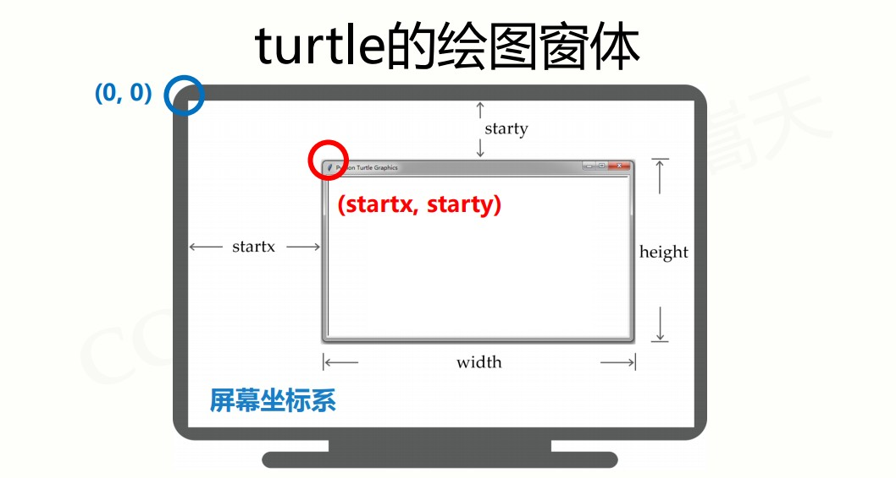
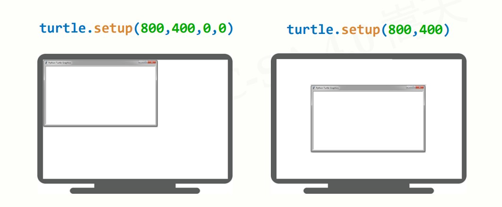
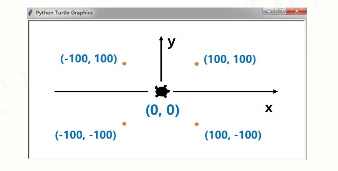
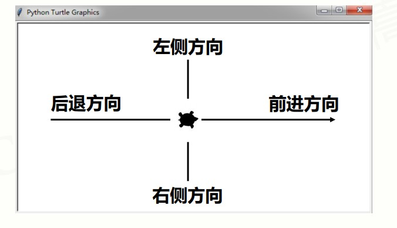
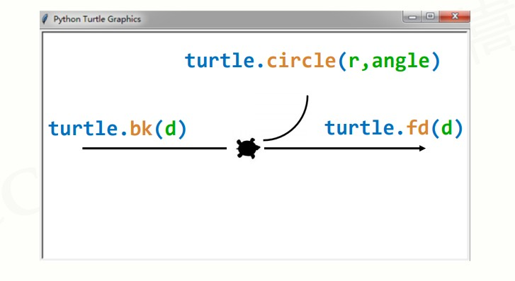
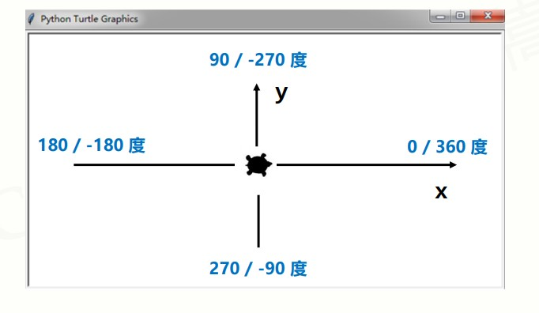
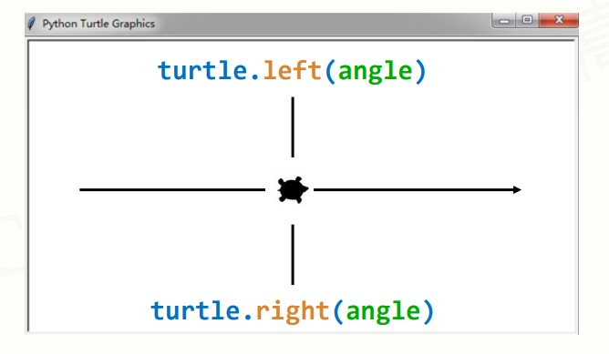

# 模块1：turtle库

### turtle库简介

> turtle（海龟）库是turtle绘图体系的Python实现。
>
> turtle绘图体系诞生于1969年，主要用于程序设计入门。
>
> turtle库是Python语言的**标准库**之一，是入门级的图形绘制函数库。


### turtle的原理

> 有一只海龟，在窗体正中心，在画布上游走。走过的轨迹形成了绘制的图形。海龟由程序控制，可以变换颜色、改变宽度等。


### turtle绘图窗体布局

调用turtle库进行绘画，会在电脑屏幕上新建一个窗口，即这里所说的绘图窗体。

绘图窗体是turtle的一个画布空间，最小单位是像素。

```python
turtle.setup(width, height, startx, starty) #后两个参数可选
```

可以用 `setup()` 函数修改绘图窗体的布局。（若不设置，则默认在屏幕正中）




示例：




### turtle空间坐标体系

#### （一）绝对坐标

以绘图窗体正中为坐标原点（0,0）

```python
turtle.goto(x, y)
```



示例：

```python
import turtle
turtle.goto(100, 100)
turtle.goto(100, -100)
turtle.goto(-100, -100)
turtle.goto(-100, 100)
turtle.goto(0,0)
```


#### （二）海龟坐标

以海龟前进的方向。海龟头的朝向为前进方向，屁股朝向为后退方向，左手边为左侧方向，右手边为右侧方向。



```python
#根据半径radius绘制extent角度的弧形
turtle.circle(radius, extent)
#回退
turtle.bk(d)
#前进
turtle.fd(d)
```



### turtle角度坐标体系

#### （一）绝对角度

与数学中坐标系的定义一致。



```python
turtle.seth(angle)
#seth() 改变海龟行进方向，但不行进
#angle为绝对角度
```


#### （二）海龟角度

以海龟头朝向的方向，向左或向右转向相应的角度。



```python
import turtle
turtle.left(45)
turtle.fd(150)
turtle.right(135)
turtle.fd(300)
turtle.left(135)
turtle.fd(150)
```


### RGB色彩体系

#### 简介

> R(red) G(green) B(blue) 指红绿蓝三个通道的颜色组合。能覆盖视力所能感知的所有颜色。
>
> RGB每色取值范围 0-255 整数或 0-1 小数。


#### 常用RGB色彩

| 英文名称 | RGB整数值   | RGB小数值      | 中文名称 |
| -------- | ----------- | -------------- | -------- |
| white    | 255,255,255 | 1,1,1          | 白色     |
| yellow   | 255,255,0   | 1,1,0          | 黄色     |
| magenta  | 255,0,255   | 1,0,1          | 洋红     |
| cyan     | 0,255,255   | 0,1,1          | 青色     |
| blue     | 0,0,255     | 0,0,1          | 蓝色     |
| black    | 0,0,0       | 0,0,0          | 黑色     |
| seashell | 255,245,238 | 1,0.96,0.93    | 海贝色   |
| gold     | 255,215,0   | 1,0.84,0       | 金色     |
| pink     | 255,192,203 | 1,0.75,0.80    | 粉红色   |
| brown    | 165,42,42   | 0.65,0.16,0.16 | 棕色     |
| purple   | 160,32,240  | 0.63,0.13,0.94 | 紫色     |
| tomato   | 255,99,71   | 1,0.39,0.28    | 番茄色   |


#### turtle的RGB色彩模式

默认采用小数值，可切换为整数值。

```python
turtle.colormode(mode)
#1.0：小数值模式
#255：整数值模式
```


