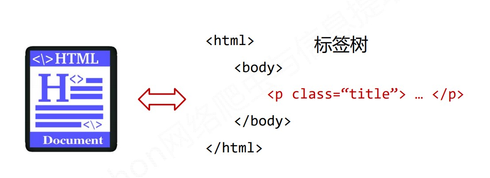
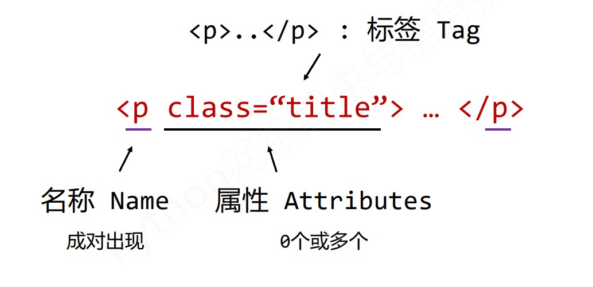

# BeautifulSoup库

[BeautifulSoup库文档](https://www.crummy.com/software/BeautifulSoup/bs4/doc/)

## 简介

BeautifulSoup库是解析、遍历、维护 “标签树” 的功能库。






## 安装

cmd命令行，执行

```python
python -m pip install beautifulsoup4
```


安装测试：

```python
import requests
from bs4 import BeautifulSoup

r = requests.get(http://python123.io/ws/demo.html)
r.text
demo = r.text

soup = BeautifulSoup(demo, 'html.parser')
print(soup.prettify)
```


## 使用

### 库的引用

```python
from bs4 import BeautifulSoup
#import bs4
```


### BeautifulSoup类

BeautifulSoup对应一个 HTML/XML 文档的全部内容。


### 解析器

```python
soup = BeautifulSoup('<html>data</html>', 'html.parser')
#'html.parser' 即为解析器可选参数
```


| 解析器           | 使用方法                                            | 条件                 |
| ---------------- | --------------------------------------------------- | -------------------- |
| bs4的HTML解析器  | `BeautifulSoup('<html>data</html>', 'html.parser')` | 安装bs4库            |
| lxml的HTML解析器 | `BeautifulSoup('<html>data</html>', 'lxml')`        | pip install lxml     |
| lxml的XML解析器  | `BeautifulSoup('<html>data</html>', 'xml')`         | pip install lxml     |
| html5lib的解析器 | `BeautifulSoup('<html>data</html>', 'html5lib')`    | pip install html5lib |

